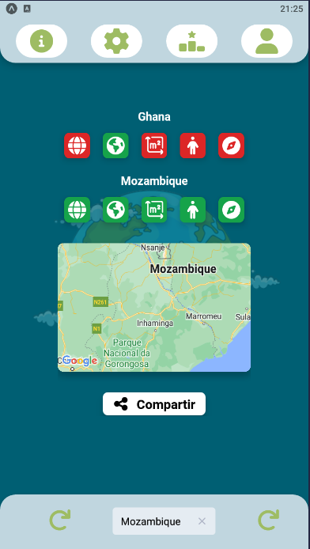
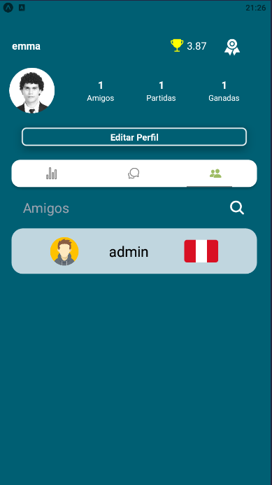
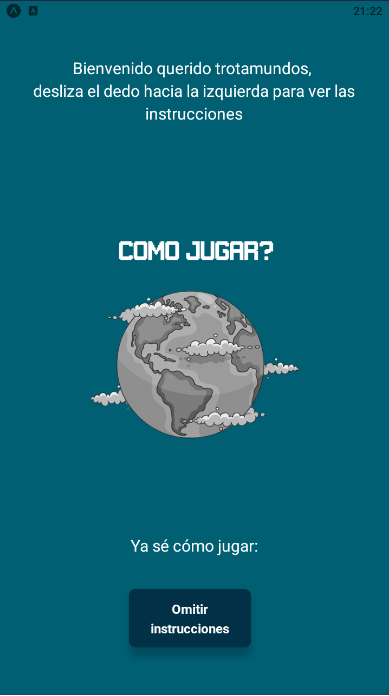
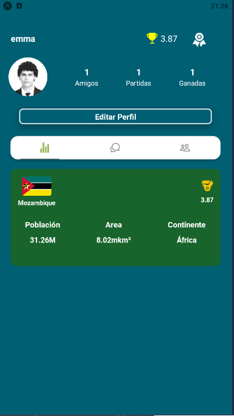
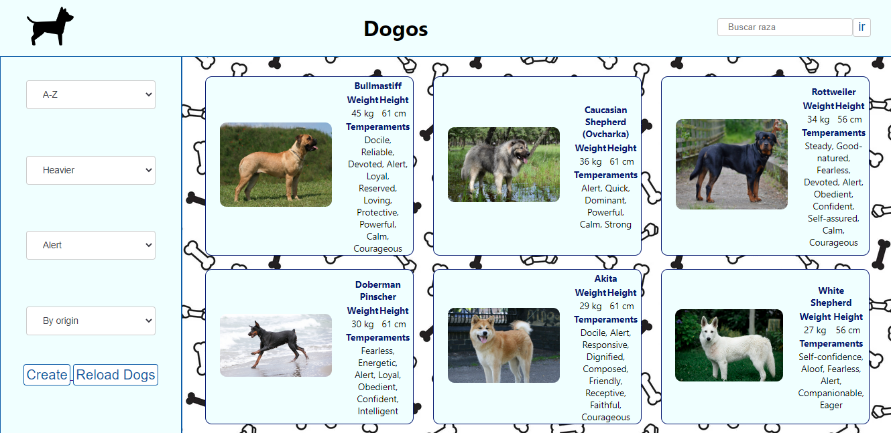
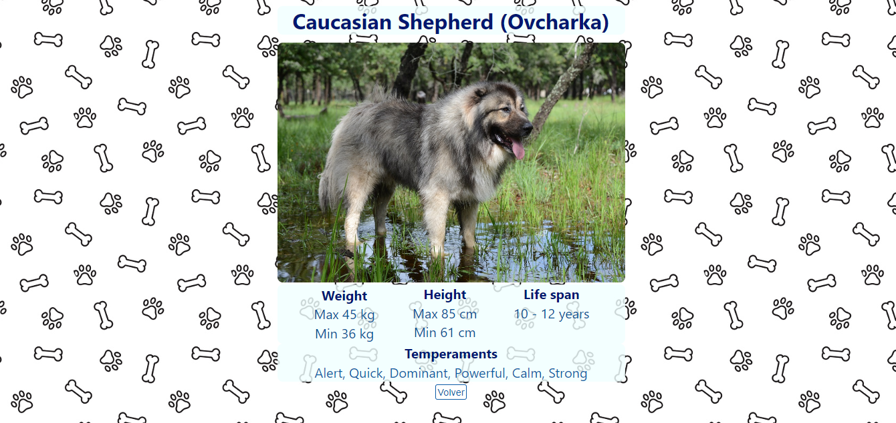

# EmmAvila
My profile
<!-- 

    

 -->

# Hi, I´m Emmanuel! 
### Electrical Engineer, Full stack web developer* 

I really enjoy learning from others and by myself. We can make great things alone, 
but I think that as a team we can do even bigger and better things.

## Checkout my work
👇
 
____________________
## Word-Game  

~~~
📌 A mobile game developed to make geography more fun

In this aplication I learn how to use React Native, I also learn about front-end libraries like Material-UI and Tailwind

🚀 Technologies: 
React Native - Redux - Tailwind - NodeJS - Express - PostgreSQL - Passport
~~~

  

____________

## Dogs Api 
~~~
📌 Individual proyect where you can find a dog by its race, name, weight or height

With this proyect I improve my knowledge on React, Redux, Express and more...

🚀 Technologies: 
React - Redux - NodeJS- Express - PostgreSQL - Sequelize
~~~

## ⚡Languages and Tools:

*Front*

<a href="https://www.w3.org/html/" target="_blank"> HTML5 </a> <a href="https://www.w3schools.com/css/" target="_blank"> CSS</a> 
<a href="https://reactjs.org/" target="_blank">ReactJS</a> <a href="https://reactnative.dev/" target="_blank">React Native</a><a href="https://redux.js.org" target="_blank"> Redux </a> <a href="https://developer.mozilla.org/en-US/docs/Web/JavaScript" target="_blank"> JavaScript </a> <a href="https://material-ui.com/" target="_blank"> MaterialUI </a><a href="https://tailwindcss.com/" target="_blank"> Tailwind</a>

*Back*

<a href="https://www.postgresql.org" target="_blank"> PostgreSQL </a> <a href="https://nodejs.org" target="_blank"> NodeJS </a> 
<a href="https://expressjs.com" target="_blank"> ExpressJS </a><a href="https://socket.io/" target="_blank"> Socket.IO </a>  

___________________________________________

## 📫 CONTACT ME

Want to work together? 

**Email:** e.avila.casta@gmail.com

<a href="linkedin.com/in/emmanuel-avila-dev" target="blank">
LinkedIn</a>
